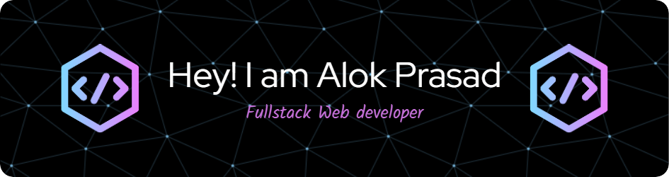

    

<h3 align="left">
  I am a B.Tech student at Rungta College of Engineering and Technology, specializing in Computer Science and Artificial Intelligence. My passion lies in coding, problem-solving, and exploring new technologies to build impactful solutions.
  Currently, I am learning web development using the MERN stack (MongoDB, Express.js, React.js, Node.js) and actively seeking opportunities to contribute to open-source projects. I thrive on collaboration and innovation, constantly pushing boundaries to create dynamic and scalable applications.
</h3>

<h2 align="left">Some Facts About Me</h2>

- 🌱 I’m currently learning **Web Development**

- 📫 How to reach me: [LinkedIn](https://www.linkedin.com/in/alok-prasad-474962289/)

<h2 align="left">Skillset</h2>

<h3 align="left">Programming Languages:</h3>

    
    &nbsp;&nbsp;&nbsp;&nbsp;
    
    &nbsp;&nbsp;&nbsp;&nbsp;
    
    &nbsp;&nbsp;&nbsp;&nbsp;
    

<h3 align="left">Frontend Development:</h3>

    
    &nbsp;&nbsp;&nbsp;&nbsp;
    
    &nbsp;&nbsp;&nbsp;&nbsp;
    
    &nbsp;&nbsp;&nbsp;&nbsp;
    
    &nbsp;&nbsp;&nbsp;&nbsp;
    

<h3 align="left">Backend Development:</h3>

    
    &nbsp;&nbsp;&nbsp;&nbsp;
    
    &nbsp;&nbsp;&nbsp;&nbsp;

<h3 align="left">Database Management:</h3>

    
    &nbsp;&nbsp;&nbsp;&nbsp;
    

<h3 align="left">Softwares:</h3>

    
    &nbsp;&nbsp;&nbsp;&nbsp;
    

<h3 align="left">Static Site Generators:</h3>

    

<h3 align="left">Others:</h3>

    

 
 

<h2 align="left">Connect with Me</h2>

    
    &nbsp;&nbsp;&nbsp;&nbsp;
    
    &nbsp;&nbsp;&nbsp;&nbsp;
    
    &nbsp;&nbsp;&nbsp;&nbsp;
    

