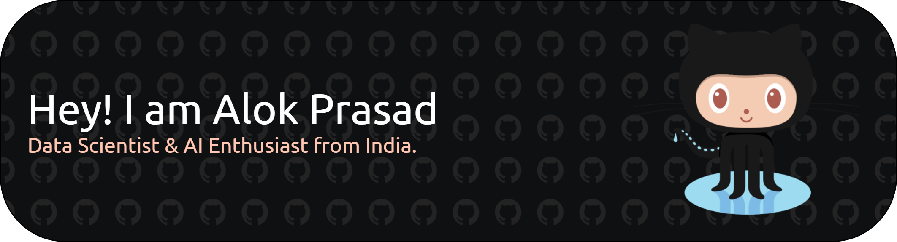
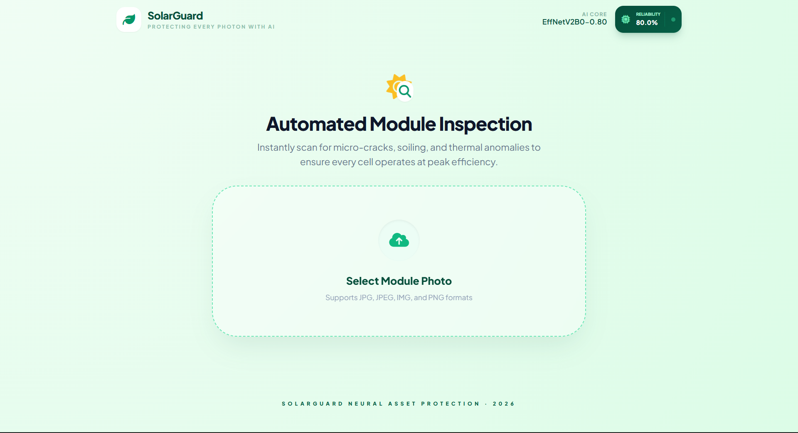
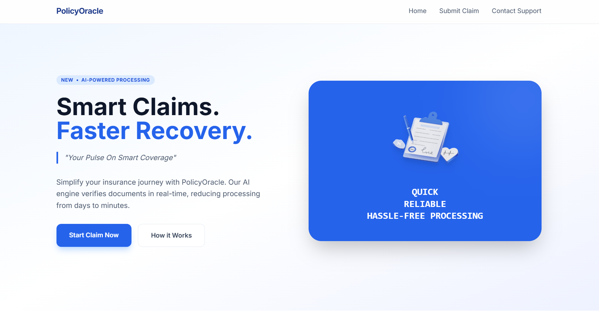
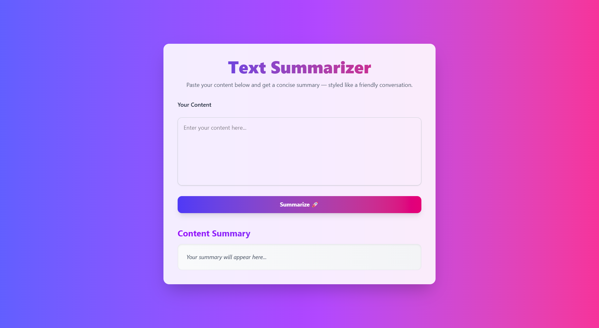

<!-- 

# Hey, I'm Alok Prasad!

 -->

## 🚀 About Me

I'm Alok, a Cyber-Engineer specializing in AI and Machine Learning.
From the halls of Rungta International Skills University to the global digital grid, I work to deploy software that acts as a catalyst for human progress.

## 📚 Learning & Knowledge

- 🌱 I'm currently learning **Data Science & Gen AI**
- 🎓 Currently pursuing B.Tech in Cyber Engineering at Rungta International Skills University, Bhilai
- 🤖 Deeply interested in Artificial Intelligence and its real-world applications.
- 🔗 Always open to learning new technologies and improving my skills.

## 🚀 Projects

| Preview | Project Details |
| :---: | :--- |
|  | **[StackScore](https://github.com/alokprasad573/StackScore)** StackScore is an AI-powered resume analyzer that helps job seekers optimize their resumes for specific companies and roles using ATS-friendly feedback, built with React, TypeScript, and Puter.js.  **Technologies:** React Router v7, TypeScript, Puter.js, Tailwind CSS, Vercel **Link:** [GitHub Repo](https://github.com/alokprasad573/StackScore) |
|  | **[SolarGuard: Protecting Every Photon with AI](https://github.com/alokprasad573/SolarGuard.git)** An automated deep learning solution designed to identify physical and electrical anomalies in solar panels. Using an EfficientNetV2B0 backbone, this system categorizes module health into 6 distinct classes, enabling predictive maintenance for sustainable energy infrastructure.  **Technologies:** Python, Tensorflow, HTML5, TailwindCSS, Flask **Link:** [GitHub Repo](https://github.com/alokprasad573/SolarGuard.git) |
|  | **[PolicyOracle](https://github.com/alokprasad573/PolicyOracle.git)** PolicyOracle is an advanced RAG (Retrieval-Augmented Generation) framework designed to automate the lifecycle of insurance claim processing—from raw data ingestion to final audit reporting.  **Technologies:** Python, Langchain, Flask, HTML5, TailwindCSS, JavaScript, Pinecone **Link:** [GitHub Repo](https://github.com/alokprasad573/PolicyOracle.git) |
|  | **[Text Summarizer](https://github.com/alokprasad573/Text-Summarizer)** A complete pipeline for training and deploying an advanced AI text summarization model using Hugging Face's transformers library and a FastAPI backend. This project focuses on summarizing conversational dialogues and features a sleek, modern web frontend.  **Technologies:** Python, FastAPI, HTML5, TailwindCSS **Link:** [GitHub Repo](https://github.com/alokprasad573/Text-Summarizer) |

## 🎓 Education

| Institution | Degree | Duration |
|---|---|---|
| Chhattisgarh Swami Vivekanand Technical University, Bhilai | Bachelor of Technology | 2023-08 - 2027-06 |
| Gaya College, Gaya | Intermediate Science (I.Sc) | 2020-06 - 2022-02 |

## 🛠️ Skills & Technologies

### 💻 Programming Languages

&nbsp;&nbsp;&nbsp;&nbsp;&nbsp;&nbsp;

### 💻 Frontend Development

&nbsp;&nbsp;&nbsp;&nbsp;&nbsp;&nbsp;&nbsp;&nbsp;&nbsp;

### 💻 Backend Development

&nbsp;&nbsp;&nbsp;

### 💻 AI/ML

&nbsp;&nbsp;&nbsp;&nbsp;&nbsp;&nbsp;&nbsp;&nbsp;&nbsp;&nbsp;&nbsp;&nbsp;

### 💻 Database

&nbsp;&nbsp;&nbsp;

### 💻 DevOps

&nbsp;&nbsp;&nbsp;

### 💻 Framework

### 💻 Software

### 💻 Static Site Generators

### 💻 Other

## 📊 GitHub Stats & Activity

  

  

  

  

## 🔗 Connect with Me

  &nbsp;&nbsp;
  &nbsp;&nbsp;
  

## 💬 Quote
> 🎯 <b>"Code is like humor. When you have to explain it, it's bad." – Cory House </b>

    <b><i> Thank you for visiting my profile! </i></b> 😊

  

