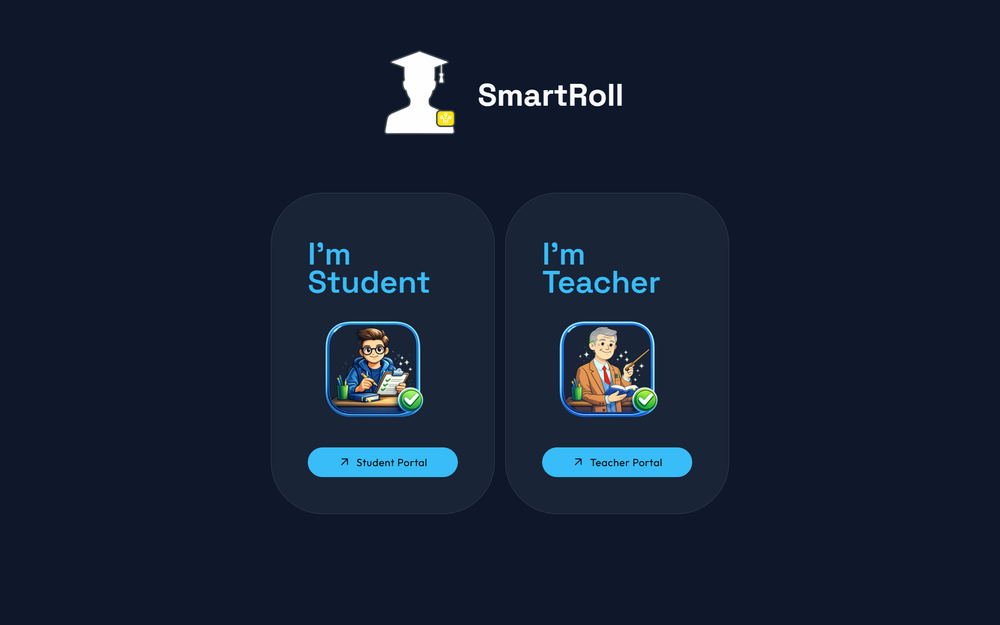

---

## 📚 About Me

I'm a B.Tech student in Cyber Engineering at Rungta International Skills University, passionate about building intelligent solutions using AI and modern web technologies. I love exploring data science, machine learning, and creating full-stack applications that solve real-world problems.

- 🌱 Currently learning **Data Science & Generative AI.**
- 🎓 B.Tech in Cyber Engineering (Expected 2027).
- 🤖 Passionate about AI/ML applications.
- 🔗 Always eager to learn new technologies.
- 🔭 I’m currently working on **Intelligent AI Attendance System.**
- 💡 Problem solver with a focus on practical implementation.

---

## 🚀 Featured Projects

| Project | Description |
| :---: | :--- |
|  | **StackScore : AI Resume Analyzer** StackScore is an AI-powered resume analyzer that helps job seekers optimize their resumes for specific companies and roles using ATS-friendly feedback, built with React, TypeScript, and Puter.js.  **Technologies:** React Router v7, TypeScript, Puter.js, Tailwind CSS, Vercel **Link:** [GitHub Repo](https://github.com/alokprasad573/StackScore.git) |
|  | **SolarGuard: Solar-Panel-Anomaly-Detection-using-Deep-Learning** An automated deep learning solution designed to identify physical and electrical anomalies in solar panels. Using an EfficientNetV2B0 backbone, this system categorizes module health into 6 distinct classes, enabling predictive maintenance for sustainable energy infrastructure.  **Technologies:** Python, Tensorflow, HTML5, TailwindCSS, Flask **Link:** [GitHub Repo](https://github.com/alokprasad573/Solar-Panel-Anomaly-Detection-using-Deep-Learning.git) |
|  | **PolicyOracle : GenAI-based-Health-Insurance-Auditor** PolicyOracle is an advanced RAG (Retrieval-Augmented Generation) framework designed to automate the lifecycle of insurance claim processing—from raw data ingestion to final audit reporting.  **Technologies:** Python, Langchain, Flask, HTML5, TailwindCSS, JavaScript, Pinecone **Link:** [GitHub Repo](https://github.com/alokprasad573/GenAI-based-Health-Insurance-Auditor.git) |
|  | **SmartRoll : Intelligent AI Attendance with Face Recognition** SmartRoll is a modern, AI-powered attendance management system that leverages Face Recognition to provide a seamless and secure attendance-tracking experience. Built with Streamlit, Supabase and KNN classifier, it offers dedicated portals for both teachers and students.  **Technologies:** Python, Streamlit, Scikit-Learn(KNN), Supabase **Link:** [GitHub Repo](https://github.com/alokprasad573/Intelligent-AI-Attendance-with-Face-Recognition) |

## 🎓 Education

| Institution | Degree | Duration |
|---|---|---|
| Rungta International Skills University, Bhilai | B.Tech in Cyber Engineering | 2023 - 2027 |
| Gaya College, Gaya | Intermediate Science (I.Sc) | 2020 - 2022 |
| Hansraj Public School, Gaya | Matriculation (10th Board) | 2020

---

## 🛠️ Technical Skills

### 💻 Programming Languages

### 🎨 Frontend Development

### 🖥️ Backend Development

### 🤖 AI/ML & Data Science

### 💾 Databases

### 🛠️ DevOps Tools

---

## 📊 GitHub Statistics

  

  
  

  

---
<!--------
## 🧮 LeetCode Progress

  

---
----->
## 🔗 Connect With Me

  &nbsp;&nbsp;&nbsp;
  &nbsp;&nbsp;&nbsp;
  

---

## 💭 Favorite Quote

> 🎯 *"Code is like humor. When you have to explain it, it's bad."* – Cory House

---

  <i>Thank you for visiting my profile! Feel free to explore my projects and connect with me.</i> 😊

  

